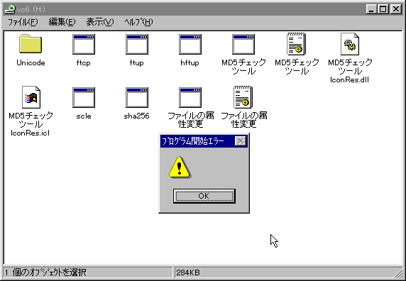

<h1>ランタイム</h1>
<h2>Visual C++ ランタイム</h2>
<h3><a name="VC6RUNTIME" id="VC6RUNTIME">Visual C++ 6.0 SP6ランタイム</a></h3>

<a href="vc/vc6sp6_redist.exe">vc6sp6_redist.exe</a>

<code>SHA-256: ce05a2ad669fdc331cf43b4637f7c596c279685bc45eab005c15eb5ea495d5ea</code>

Windows 95でプログラム開始エラーが出た場合は入れてください。

<h3><a name="VC2005RUNTIME" id="VC2005RUNTIME">Visual C++ 2005 SP1ランタイム</a></h3>

<a href="vc/vc2005SP1_redist_x86.exe">vc2005SP1_redist_x86.exe</a>

<code>SHA-256: 35448a90de68a109b94bf79380691b4afdf42b4a102ba95758437d46869179c1</code>

MSVCR80.DLLのエラーが出てきたら入れてください。

<ol>
  <li>Windows 98では、Windowsインストーラーの更新が必要です。<a href="#MSI2">リンク先からインストール</a>してください。
</ol>
<h3><a name="VC2005X64RUNTIME" id="VC2005X64RUNTIME">Visual C++ 2005 SP1ランタイム 64ビット版</a></h3>

<a href="vc/vc2005SP1_redist_x64.exe">vc2005SP1_redist_x64.exe</a>

64ビット版

<code>SHA-256: 41db428a1c860ea5b43f7671bd8f28131efc1210e790be833bd77895a348492c</code>

MSVCR80.DLLのエラーが出てきたら入れてください。

<ol>
  <li>64ビット版のWindows 以外はインストールできないので注意してください。
</ol>
<h3><a name="VC2010RUNTIME" id="VC2010RUNTIME">Visual C++ 2010 SP1ランタイム</a></h3>

<a href="vc/vc2010SP1_redist.exe">vc2010SP1_redist.exe</a>

<code>SHA-256: 41db428a1c860ea5b43f7671bd8f28131efc1210e790be833bd77895a348492c</code>

MSVCR100.DLLのエラーが出てきたら入れてください。

<h3><a name="VC2010X64RUNTIME" id="VC2010X64RUNTIME">Visual C++ 2010 SP1ランタイム 64ビット版</a></h3>

<a href="vc/vc2010SP1_redist_x64.exe">vc2010SP1_redist_x64.exe</a>

64ビット版

<code>SHA-256: cc7ec044218c72a9a15fca2363baed8fc51095ee3b2a7593476771f9eba3d223</code>

MSVCR100.DLLのエラーが出てきたら入れてください。

<ol>
  <li>64ビット版のWindows 以外はインストールできないので注意してください。
</ol>
<h3><a name="VC2022X64RUNTIME" id="VC2022X64RUNTIME">Visual C++ 2022 ランタイム 64ビット版</a></h3>

<a href="vc/vc2015-2022_redist_x64.exe">vc2015-2022_redist_x64.exe</a>

64ビット版

<code>SHA-256: 917c37d816488545b70affd77d6e486e4dd27e2ece63f6bbaaf486b178b2b888</code>

VCRUNTIME140.dllのエラーが出てきたら入れてください。

<ol>
  <li>64ビット版のWindows 以外はインストールできないので注意してください。
</ol>
<h3><a name="MSGOTUPD" id="MSGOTUPD">MS UI Gothic パッチ (Windows 95にインストールしてください)</a></h3>

<a href="win95/msgotupd.exe">msgotupd.exe</a>

<code>SHA-256: e4a021366c9cae1c433b4cd6d96b79272f932cfe713ad9afe4fd14a2142c79ae</code>

Windows 98で追加された「MS UI Gothic」が使えるようになります。

Word文章や「MD5チェックツール」「ファイルの属性変更」など、文字のレイアウトが大きく変わってしまう場合にご利用ください。 
ダウンロード後に実行して再起動すれば完了です。

<h3><a name="MSI2" id="MSI2">Windows インストーラー 2.0 (Windows 95、98、ME)</a></h3>

<a href="msi/InstMsiA.exe">InstMsiA.exe</a>

<code>SHA-256: 536e4c8385d7d250fd5702a6868d1ed004692136eefad22252d0dac15f02563a</code>

Windows 95、98、MEのWindows インストーラー 2.0です。 
Visual C++ 2005 SP1 ランタイム、Operaブラウザがインストールできないときにご利用ください。

<h3><a name="MSI2W" id="MSI2W">Windows インストーラー 2.0 (Windows 2000)</a></h3>

<a href="msi/InstMsiW.exe">InstMsiW.exe</a>

<code>SHA-256: 4c3516c0b5c2b76b88209b22e3bf1cb82d8e2de7116125e97e128952372eed6b</code>

Windows 2000のWindows インストーラー 2.0です。 
Visual C++ 2005 SP1 ランタイム、Operaブラウザがインストールできないときにご利用ください。

